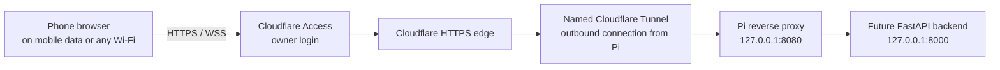

# Botanika Phone ↔ Raspberry Pi Connectivity Implementation Guide

**Purpose:** establish the first working stage of Botanika: a phone and the
Raspberry Pi can be on completely different networks, connect securely through a
normal phone browser, and exchange a cropped plant image without transmitting
live video or the complete camera frame.

**Status:** implementation plan only. This document intentionally contains no
application code.

**Target result:** the phone opens one stable HTTPS address, authenticates,
connects to the Pi, and can send one binary image crop to a Pi endpoint. The Pi
acknowledges the upload and can later pass that crop into the species classifier.

---

## 1. What is being built in this stage

This stage builds the communication path before plant classification, the final
UI, or YOLO integration.

The phone never connects directly to the Pi’s residential public IP. The Pi
opens an outbound tunnel to Cloudflare. This works through normal NAT,
carrier-grade NAT, changing IP addresses, and different Wi-Fi/mobile networks.
No router port forwarding is required.

### End-to-end plant capture behavior this connection must support

When the later vision stages are implemented, the completed flow will be:

1. The phone camera remains local to the browser.
2. A small browser-side detector examines resized frames locally.
3. The detector draws a box around a plant or useful plant organ.
4. The browser tracks that same box across several frames.
5. When the box is stable and the pixels inside it are sufficiently sharp, the
   browser captures one still frame in memory.
6. The browser crops only the box region, with a small amount of context padding.
7. The full still frame is immediately discarded.
8. Only the encoded crop is uploaded through HTTPS to the Pi.
9. The Pi validates the crop and runs the species classifier once.
10. The Pi returns the proposed plant identity, confidence, alternatives, and
    knowledge details.
11. The phone updates the existing box with the plant name above it and the
    confidence underneath it.

This first stage proves steps 8 and the connection surrounding it. A temporary
test image can stand in for the future browser-generated crop until the detector
and capture-quality stages are implemented.

---

## 2. Decisions fixed by this guide

| Concern | Decision |
|---|---|
| Remote connection | Named Cloudflare Tunnel |
| Public transport | HTTPS and secure WebSocket (`WSS`) |
| Phone installation | None; use the normal browser |
| Router changes | None; no inbound port forwarding |
| Stable address | A subdomain such as `botanika.yourdomain.com` |
| Internet-edge authentication | Cloudflare Access with owner email OTP initially |
| Initial allowed owner | `kisoreabhinav@gmail.com` |
| Pi origin exposure | Loopback only, never `0.0.0.0` for the production origin |
| Browser/API origin | Same hostname for UI, REST, and WebSocket |
| Image transport | Binary multipart HTTPS request, not Base64 and not WebSocket |
| Live video | Never sent to the Pi |
| Classification trigger | One stable, sharp, selected crop per capture event |
| Progress/state messages | WebSocket or REST response events; never video frames |
| Cross-network requirement | Phone and Pi each need internet; same Wi-Fi is irrelevant |
| Offline behavior | Pi SOLO remains local; remote phone cannot reach Pi without internet |

### Why two security layers will eventually exist

Cloudflare Access and Botanika pairing solve different problems:

- **Cloudflare Access** decides who is allowed to reach the application from the
  internet. This prevents the Pi from becoming an anonymous public upload/API
  server.
- **Botanika pairing** decides which one already-authorized phone currently owns
  the NETWORKED session. This maintains the one-active-display rule.

Cloudflare Access should be set up in this connectivity stage. The in-app QR/
short-code pairing lease is implemented later with the mode-management stage.

---

## 3. Prerequisites and information to collect

Do not install tunnel software until these items are settled and recorded.

### 3.1 Required accounts and assets

- A Cloudflare account controlled by the project owner.
- A domain added to and active on Cloudflare.
- A selected public hostname, recommended format:
  `botanika.<your-domain>`.
- Access to `kisoreabhinav@gmail.com` for Cloudflare one-time PIN login.
- Administrator access on the Pi.
- Pi internet access through Ethernet or Wi-Fi.
- A phone with mobile data for the actual different-network test.

A stable Cloudflare published application requires a domain on Cloudflare. If a
domain is not yet available, use Tailscale Funnel only as a temporary prototype.
It can provide a stable `*.ts.net` HTTPS name, but its bandwidth limitations and
access-control model make it the fallback rather than the planned production
route. Do not build around a Cloudflare Quick Tunnel because its random URL is
not a permanent product address.

### 3.2 Record these choices before continuing

Create a private deployment record outside Git containing:

- Cloudflare account/zone owner;
- selected domain and Botanika subdomain;
- tunnel name, recommended `botanika-pi-production`;
- tunnel UUID after creation;
- Access application name;
- Pi operating-system release and CPU architecture;
- Pi local interface used for internet access;
- chosen local reverse-proxy port: `127.0.0.1:8080`;
- chosen future API port: `127.0.0.1:8000`;
- date the tunnel token was created or rotated.

Do not put the tunnel token, Cloudflare API token, private keys, cookies, or the
private deployment record in Git. The repository `.gitignore` already reserves
`deploy/cloudflared/` for templates while ignoring tunnel credential files.

### 3.3 Pi readiness checks

Before installing anything, confirm:

1. The Pi’s clock and timezone are correct and time synchronization is active.
   TLS and authentication can fail when the clock is wrong.
2. DNS resolution and outbound HTTPS work.
3. Outbound connectivity to Cloudflare is allowed. Restrictive networks may
   need outbound port `7844`; normal home/mobile networks usually require no
   change.
4. The Pi is ARM64, so the correct `cloudflared` package is selected.
5. The SSD has healthy free space even though this stage stores no images.
6. The system can restart services through systemd after reboot.
7. No existing service already occupies loopback ports `8080` or `8000`.

---

## 4. Phase A — Prepare the stable Cloudflare hostname

### Step A1 — Add or verify the domain

1. Sign in to the Cloudflare dashboard.
2. Add the project’s domain if it is not already present.
3. Complete the registrar nameserver change requested by Cloudflare.
4. Wait until Cloudflare shows the zone as active.
5. Enable normal DNS security recommendations, but do not create an exposed `A`
   record pointing at the Pi or home router.
6. Select the subdomain that the phone will always use. Keep UI, API, and
   WebSocket on this one hostname to avoid unnecessary CORS and cookie problems.

**Checkpoint A1:** the domain is active in Cloudflare and the final Botanika
hostname is recorded, even though it does not serve the application yet.

### Step A2 — Create the Access identity path

1. Open Cloudflare Zero Trust and create the organization if required.
2. Confirm that email one-time PIN is available as an identity method.
3. Do not create an “Everyone” or “any valid email” allow rule.
4. Plan the initial allow policy for exactly `kisoreabhinav@gmail.com`.
5. Choose a reasonable session duration for development, such as eight hours.
   Shorten it later if the device will be shared or deployed publicly.

**Checkpoint A2:** the owner has a functioning identity method and no broad
allow rule exists.

### Step A3 — Create the self-hosted Access application

1. In Zero Trust, create a self-hosted web application.
2. Give it an unambiguous name such as `Botanika Pi Production`.
3. Set the application hostname to the exact selected Botanika hostname.
4. Create an Allow policy containing the single owner email.
5. Select email one-time PIN as the permitted login method.
6. Leave the application default-deny for everyone else.
7. Confirm cookie settings apply to the same hostname used by the future PWA,
   REST endpoints, and WebSocket.

Creating Access before publishing the tunnel minimizes the time in which a new
hostname could be internet-reachable without the intended login gate.

**Checkpoint A3:** visiting the not-yet-published hostname does not expose an
origin service, and the Access policy is visible in the dashboard.

---

## 5. Phase B — Prepare the Pi origin boundary

### Step B1 — Reserve runtime responsibilities

Use the following process boundaries when implementation begins:

| Process | Bind/target | Purpose |
|---|---|---|
| Reverse proxy | `127.0.0.1:8080` | One local origin for frontend, API, and WSS |
| FastAPI | `127.0.0.1:8000` | Application APIs and WebSocket |
| `cloudflared` | Outbound only | Connect Cloudflare to the reverse proxy |
| Kiosk browser | Local URL | Pi-screen client; not an internet ingress |

The reverse proxy will eventually:

- serve the compiled PWA at `/`;
- forward `/api/` to FastAPI;
- forward `/ws/` with WebSocket upgrade support;
- apply a request-body size limit;
- add basic security headers;
- disable caching for authenticated API responses;
- allow long-lived WebSocket connections without allowing indefinite image
  uploads.

The tunnel should target `http://localhost:8080`. Local HTTP is acceptable on
this loopback hop because external traffic is protected by HTTPS and the
Cloudflare tunnel; the origin never leaves the Pi.

### Step B2 — Enforce loopback-only exposure

1. Configure the placeholder/reverse proxy to listen only on `127.0.0.1`.
2. Configure the future FastAPI process the same way.
3. Do not expose either port through the router.
4. Do not open either port in the Pi firewall for LAN clients.
5. Verify locally that the placeholder responds through loopback.
6. From a second device on the Pi’s LAN, verify that `<pi-lan-ip>:8080` and
   `<pi-lan-ip>:8000` do not respond.

This creates a valuable invariant: if `cloudflared` is stopped, no external
network can reach the Botanika origin.

### Step B3 — Define the temporary connectivity placeholder

Before building the real backend, the placeholder needs only these conceptual
capabilities:

- a page that visibly identifies the Pi and build/environment;
- a liveness response;
- a readiness response showing the placeholder is prepared for an upload test;
- a temporary binary-image receipt endpoint;
- an optional WebSocket heartbeat endpoint.

The temporary receipt endpoint must validate and report only:

- request ID;
- accepted/rejected state;
- decoded image width and height;
- MIME type;
- byte count;
- server receipt time;
- content hash for proving the transferred bytes arrived intact.

It must not classify or retain the image. Delete temporary bytes immediately
after producing the receipt. This endpoint is later replaced by the real
classification contract.

**Checkpoint B:** the origin responds locally, accepts a representative image
crop, deletes it, and is unreachable through the Pi’s LAN address.

---

## 6. Phase C — Create and run the named tunnel

### Step C1 — Create the tunnel in Cloudflare

1. Open Cloudflare Dashboard → Networking → Tunnels.
2. Create a Cloudflare Tunnel named `botanika-pi-production`.
3. Select the Linux/ARM64 connector instructions.
4. Treat the displayed tunnel token as a secret.
5. Record the tunnel UUID in the private deployment record.
6. Never paste the token into documentation, screenshots, issues, shell history
   shared with others, or repository files.

### Step C2 — Install the connector on the Pi

1. Install the official ARM64 `cloudflared` package from Cloudflare’s documented
   repository/package source.
2. Verify the installed binary architecture and version.
3. Install the tunnel connector as a systemd service using the token from the
   dashboard.
4. Inspect the systemd unit to ensure it starts at boot and restarts after a
   transient failure.
5. Confirm the service is active and the Cloudflare dashboard reports the
   connector as healthy.
6. Confirm logs do not print the token.

Do not run the permanent tunnel inside a manually opened terminal. The service
must survive logout and reboot.

### Step C3 — Publish the application route

1. Open the new tunnel’s Routes section.
2. Add a Published Application route.
3. Enter the selected Botanika hostname.
4. Set the service URL to the Pi loopback reverse proxy at
   `http://localhost:8080`.
5. Save the route and let Cloudflare create the proxied DNS record pointing to
   the tunnel UUID.
6. Confirm the DNS record is a Cloudflare-proxied tunnel record, not a direct
   record containing the home public IP.

### Step C4 — Confirm tunnel health

The tunnel is ready only when all of the following are true:

- the Cloudflare dashboard reports a healthy connector;
- the Pi service is active;
- the stable hostname resolves publicly;
- an unauthenticated browser is redirected to Cloudflare Access;
- an authenticated browser reaches the Pi placeholder;
- stopping the local placeholder produces an origin failure without changing
  DNS or exposing another service;
- restarting the placeholder restores the same URL;
- restarting `cloudflared` reconnects without changing the URL.

**Checkpoint C:** one stable HTTPS URL reaches only the intended loopback
service through an authenticated tunnel.

---

## 7. Phase D — Prove phone and Pi work on different networks

Do not perform the main test while both devices are on the same Wi-Fi.

### Step D1 — Separate the networks

1. Leave the Pi connected to its normal Ethernet or Wi-Fi internet connection.
2. Turn Wi-Fi off on the phone.
3. Confirm the phone is using cellular/mobile data.
4. Open the stable Botanika HTTPS hostname in a normal browser tab.

### Step D2 — Verify Access authentication

1. Enter `kisoreabhinav@gmail.com` on the Cloudflare Access page.
2. Request the one-time PIN.
3. Enter the received PIN and complete sign-in.
4. Confirm the Pi placeholder loads.
5. Open a private/incognito window and verify it must authenticate separately.
6. Try an unapproved email and verify it cannot reach the placeholder.

### Step D3 — Verify binary crop transport

Use a small, non-sensitive test plant crop—not a full personal camera frame.

1. Select the test crop on the phone placeholder.
2. Confirm the browser displays the crop dimensions and approximate size before
   upload.
3. Upload it as binary multipart form data over the same HTTPS hostname.
4. Confirm the Pi returns its dimensions, MIME type, byte size, and hash.
5. Compare the phone-side and Pi-side hashes if the test client calculates both.
6. Confirm temporary upload storage is empty after the response.
7. Repeat with phone Wi-Fi on a network different from the Pi’s network.
8. Repeat after rebooting the Pi.

### Step D4 — Verify reconnect behavior

1. Open the future heartbeat/status connection.
2. Toggle phone airplane mode briefly.
3. Confirm the UI changes to disconnected instead of freezing.
4. Disable airplane mode.
5. Confirm the status connection uses bounded exponential backoff and returns to
   connected without reloading the entire application when the Access session is
   still valid.
6. Attempt an upload during disconnection. Confirm the crop remains in phone
   memory and the UI offers Retry or Cancel.
7. Cancel and verify the retained crop is discarded.

### Step D5 — Measure the connection

Record at least:

- placeholder page load time after authentication;
- liveness request median and slowest time;
- WebSocket reconnect time;
- crop size;
- crop upload duration;
- receipt response duration;
- failure/recovery time after Pi reboot;
- failure/recovery time after Pi internet interruption.

Do not optimize from one number. Repeat each measurement at least ten times over
mobile data and inspect median and worst-case behavior.

**Checkpoint D:** the phone reaches the Pi and transfers a crop while the two
devices are provably on different networks.

---

## 8. Exact future crop-only capture pipeline

This section defines the contract that the connectivity stage must preserve when
YOLO/detection is added. It prevents the later vision work from accidentally
turning into video streaming or full-frame uploads.

### 8.1 Camera frame ownership

- The active browser obtains the camera stream locally.
- Raw frames remain inside the active device.
- The Pi receives no live frame, thumbnail stream, screen recording, WebRTC
  track, MJPEG stream, or periodic screenshot.
- The detector receives a resized local frame suited to its model input.
- The full-resolution source remains available only long enough to make the
  accepted crop.

### 8.2 Detection and target selection

1. Run a small ONNX detector through ONNX Runtime Web in a Web Worker.
2. Start with a `plant` target class; add leaf/flower/fruit/bark organ classes
   only after custom training and validation.
3. Apply detector confidence filtering and non-maximum suppression locally.
4. Draw boxes on a separate overlay canvas rather than modifying camera pixels.
5. If there are several plants, choose the stable central/largest box by default
   and let the user tap another one.
6. Track the selected target between frames using box overlap, center movement,
   and size change. Do not regard unrelated boxes as one stable target.

The initial box label should say `Plant` or the detected organ. It must not show
a species name before the Pi classifier responds.

### 8.3 Stability and sharpness gate

An automatic capture becomes eligible only when all configured checks pass for
several consecutive observations:

- selected box overlap remains above the calibrated threshold;
- box-center movement remains below the calibrated threshold;
- box-size change remains below the calibrated threshold;
- plant occupies enough pixels for classification;
- the box is not clipped by a frame edge;
- exposure is not severely dark or saturated;
- Laplacian variance or the selected focus metric passes the camera-specific
  threshold;
- no upload/classification request is already active for this lock event.

Do not freeze universal values during design. Begin evaluation around three to
five consecutive stable detections, then calibrate thresholds separately on the
supported phone and Pi Camera using sharp/blurry and moving/still fixtures.

### 8.4 Coordinate conversion before cropping

The visible video and source camera frame may have different sizes and aspect
ratios. CSS may also apply `object-fit: cover`, cropping edges from the displayed
preview. The implementation must:

1. retain the detector’s coordinates in a known reference space;
2. account for model resize/letterboxing when converting the box back to the
   source frame;
3. account for preview cropping and device pixel ratio only when processing user
   taps/overlay placement;
4. use the camera’s actual `videoWidth` and `videoHeight` for the source crop;
5. correct orientation and mirroring exactly once;
6. verify with test-pattern frames that the saved pixels match the visible box.

A box drawn correctly on screen does not prove the source crop is correct. This
mapping needs its own automated fixtures and real-device test.

### 8.5 Crop construction

1. Expand the selected box by a small configurable context margin, initially
   evaluating roughly 5–10 percent on each side.
2. Clamp expanded coordinates to the source-frame boundaries.
3. Reject a crop below the classifier’s minimum usable pixel dimensions.
4. Draw only that source rectangle into an offscreen crop canvas/buffer.
5. Re-run the sharpness and exposure check on the crop itself.
6. Resize only if needed, preserving aspect ratio; initial upper bound should be
   evaluated around 1024 pixels on the longest side.
7. Encode as JPEG or WebP after checking browser and inference compatibility.
   An initial JPEG quality near 0.85 is a benchmark starting point, not a final
   constant.
8. Strip EXIF and unrelated metadata by re-encoding through the browser canvas.
9. Create the request from the crop blob.
10. Release the full-frame buffer immediately.

Never implement cropping by uploading the full frame and asking the Pi to crop
it. That breaks the explicit privacy, bandwidth, and architecture requirement.

### 8.6 Upload request contract

Use one same-origin HTTPS request to the future classification endpoint. Send:

| Part | Contents |
|---|---|
| `image` | Binary JPEG/WebP crop blob |
| `metadata` | Small structured capture metadata object |
| request header | Unique idempotency/request ID |

The metadata should contain only what processing needs:

- capture event ID and timestamp;
- client type: phone or Pi kiosk;
- detector name/version;
- detector class and score;
- source frame dimensions, without source pixels;
- final crop dimensions;
- normalized selected-box coordinates;
- stability score/window result;
- blur/focus score and threshold profile ID;
- exposure check result;
- orientation applied;
- optional organ hint;
- app version.

GPS does not need to accompany classification. Request location only when the
user chooses **Save to Library**, reducing permission prompts and avoiding exact
location in transient classifier logs.

Use multipart binary transport rather than Base64 because Base64 increases size
and memory usage. Use REST for image transfer; reserve WebSocket for small status
events such as connected, queued, processing, result-ready, mode change, and
pairing state.

### 8.7 Provisional size and timing limits

These are starting boundaries to benchmark, not permanent accuracy choices:

- desired crop payload: normally below 1 MB;
- hard server request limit: initially 5 MB;
- accepted formats: JPEG and WebP after decode verification;
- one active classification request per controller;
- short queue with a visible busy state;
- explicit upload and classification timeouts;
- one retry after a transient network failure using the same idempotency ID;
- never retry an accepted request indefinitely.

### 8.8 Pi upload lifecycle

The future Pi endpoint must perform this order:

1. Confirm Cloudflare Access identity at the origin.
2. Confirm the Botanika controller lease once pairing exists.
3. Confirm NETWORKED mode permits the request.
4. Apply body-size and request-rate limits before decoding.
5. Validate declared MIME type, magic bytes, and actual decoded image.
6. Reject malformed, oversized, decompression-bomb, or unsupported images.
7. Generate a server-owned temporary name; never trust the client filename.
8. Normalize the crop according to the registered classifier contract.
9. Run one species classification.
10. Join accepted identity candidates to the local species database.
11. Return result or a clear rejection/retry state.
12. Delete temporary bytes in success, error, timeout, and cancellation paths.
13. Log request ID, timings, sizes, model version, and outcome—but not image
    bytes, tokens, exact GPS, or raw filenames.

### 8.9 Response and UI state

The phone should use a strict state progression:

`camera → detecting → target stable → crop ready → uploading → processing → result`

Failures branch to a named recoverable state instead of resetting everything:

- connection lost: retain crop temporarily and show Retry/Cancel;
- upload rejected: explain size/format/quality reason;
- classifier busy: show queued/busy state without duplicate requests;
- low confidence: return to camera with an angle/organ suggestion;
- Pi switched to SOLO: discard remote control state and show SOLO placeholder;
- Access expired: reauthenticate, then retry only with user confirmation.

On a successful classification, update the selected box:

- plant name above the box;
- calibrated confidence below the box;
- details panel below the camera;
- explicit Save to Library action.

---

## 9. Security checklist before real image transfer

- [ ] The stable hostname uses HTTPS and redirects HTTP to HTTPS.
- [ ] Cloudflare Access protects every application route, including `/api` and
      `/ws`.
- [ ] The allow policy contains the exact owner email, not Everyone or any OTP
      user.
- [ ] The backend verifies the Access assertion/token rather than blindly
      trusting a spoofable email header.
- [ ] Pi origin processes bind only to loopback.
- [ ] The router has no Botanika port-forwarding rule.
- [ ] CORS is same-origin and does not combine wildcard origin with credentials.
- [ ] Cookies are Secure, HttpOnly where applicable, and SameSite protected.
- [ ] State-changing requests include CSRF protection.
- [ ] Upload body, pixel count, dimensions, type, timeout, and rate are bounded.
- [ ] Server-generated temporary filenames are used.
- [ ] Temporary images are deleted on every exit path.
- [ ] EXIF is stripped before upload/persistence.
- [ ] API responses containing personal/session data are not edge-cached.
- [ ] Logs do not store crops, exact GPS, authentication tokens, or raw pairing
      codes.
- [ ] Tunnel credentials and environment secrets are absent from Git.
- [ ] Tunnel token rotation has been tested once before deployment.

---

## 10. Reboot and reliability validation

The connection is not considered “consistent” until it survives normal failures.

### Pi reboot test

1. Begin from a working authenticated phone session.
2. Reboot the Pi normally.
3. Confirm the placeholder/backend, reverse proxy, and `cloudflared` start without
   an interactive login.
4. Confirm the Cloudflare dashboard returns to healthy.
5. Confirm the same hostname works again.
6. Record recovery time.

### Pi internet-loss test

1. Disconnect only the Pi network.
2. Confirm the phone reports Pi unavailable rather than a false successful state.
3. Restore Pi internet.
4. Confirm the connector re-establishes the tunnel automatically.
5. Confirm no DNS or phone configuration changes are required.

### Phone network-switch test

1. Connect while the phone uses Wi-Fi.
2. Switch the phone to mobile data.
3. Confirm transient disconnect and automatic status recovery.
4. Confirm a crop already accepted by the Pi is not uploaded twice.

### Service-failure test

Individually stop the placeholder/backend, reverse proxy, and tunnel connector.
For each failure, verify that health status and user messaging identify the right
layer, then restart it and verify recovery.

### Soak test

Keep the phone status connection open for several hours. Exercise idle periods,
screen lock/unlock, Access session expiry, repeated small uploads, and Pi thermal
monitoring. Record disconnect count and memory growth.

---

## 11. Validation matrix

| Scenario | Expected result |
|---|---|
| Phone mobile data, Pi Wi-Fi | Authenticated page and crop upload work |
| Phone outside Wi-Fi, Pi Ethernet | Same stable URL works |
| Phone and Pi coincidentally same Wi-Fi | Still uses the same HTTPS path |
| Wrong/unapproved email | Access denied before Pi origin |
| Pi has no internet | Remote unavailable; SOLO remains possible |
| Phone has no internet | Crop remains local until retry/cancel |
| Tunnel stopped | Public hostname cannot reach origin |
| Origin stopped | Auth succeeds but service shows controlled unavailable state |
| Oversized image | Rejected before classification and deleted |
| Non-image renamed as JPEG | Rejected through magic/decode validation |
| WebSocket disconnect | UI shows disconnected and reconnects with backoff |
| Pi reboot | Same hostname returns without manual tunnel launch |
| Duplicate retry ID | One classification/receipt, not two |
| Full frame accidentally selected | Client privacy test fails the build |

---

## 12. Troubleshooting order

Always diagnose from the Pi outward instead of changing several layers at once.

### Problem: local placeholder does not load

1. Check whether the reverse proxy/placeholder process is active.
2. Check whether it listens on the intended loopback port.
3. Check local service logs.
4. Fix this before investigating Cloudflare.

### Problem: tunnel dashboard is unhealthy

1. Check the `cloudflared` systemd state and journal.
2. Confirm Pi DNS, system time, and internet access.
3. Confirm outbound Cloudflare connectivity, including port `7844` on a
   restrictive network.
4. Confirm the token has not been revoked or rotated without updating the Pi.

### Problem: Access login loops or OTP does not arrive

1. Confirm the self-hosted application hostname exactly matches the tunnel
   hostname.
2. Confirm the owner email appears in an Allow policy.
3. Confirm the OTP identity method is enabled.
4. Request a fresh PIN; requesting a new one invalidates the previous PIN.
5. Check whether mail security/link scanning consumed the single-use login.

### Problem: page loads but upload fails

1. Check reverse-proxy body-size and timeout policy.
2. Check API readiness and upload validation reason.
3. Confirm the request is same-origin and includes the valid Access session.
4. Confirm the crop is sent as binary multipart data.
5. Confirm MIME, magic bytes, dimensions, and pixel count are acceptable.
6. Use the request ID to correlate phone, proxy, and backend logs.

### Problem: WebSocket fails while normal page loads

1. Confirm the client uses `wss://` at the same hostname.
2. Confirm reverse-proxy WebSocket upgrade forwarding.
3. Confirm Access cookies/authentication cover the WebSocket path.
4. Check heartbeat interval and idle timeout.
5. Confirm reconnect backoff does not create many parallel sockets.

### Problem: the uploaded crop does not match the visible box

This is not a tunnel problem. Recheck model letterboxing, video source dimensions,
CSS `object-fit`, orientation, mirroring, and overlay-to-source coordinate
conversion. Use a numbered test-pattern frame before changing model thresholds.

---

## 13. Completion criteria for this first stage

Do not call the phone/Pi connection complete until every item passes:

- [ ] One stable HTTPS hostname is documented.
- [ ] The hostname is protected by Cloudflare Access.
- [ ] Only `kisoreabhinav@gmail.com` is initially allowed.
- [ ] The Pi origin binds to loopback only.
- [ ] No router port forwarding or public Pi IP is used.
- [ ] `cloudflared` runs as a systemd service and survives reboot.
- [ ] A phone on mobile data reaches the Pi placeholder.
- [ ] A phone on a different Wi-Fi reaches the same URL.
- [ ] A binary test crop travels phone → Pi and receives a matching receipt.
- [ ] The Pi deletes temporary crop bytes after success and failure.
- [ ] A status WebSocket connects, detects loss, and reconnects.
- [ ] Upload retry does not create duplicate processing.
- [ ] Pi and phone network interruption behavior is clear and recoverable.
- [ ] Full-frame/video transfer is absent by design and verified by tests.
- [ ] Connection and upload latency measurements are recorded.
- [ ] Secrets and generated personal data are absent from Git.

The next build stage begins only after this checklist passes. That next stage is
the minimal FastAPI/PWA platform foundation, followed by voice mode management
and pairing. Browser YOLO, stability detection, crop generation, and species
classification are deliberately built after the communication path is proven.

---

## 14. Recommended implementation order from here

1. Decide/acquire the domain and Botanika subdomain.
2. Create Cloudflare Access owner authentication.
3. Create the loopback placeholder and image-receipt contract.
4. Create the named tunnel and published application route.
5. Run the mobile-data connection test.
6. Run the test-crop upload and deletion test.
7. Run WebSocket reconnect and reboot tests.
8. Record Stage 0 results and close any failures.
9. Build the application platform shell.
10. Build mode/pairing ownership.
11. Build browser detection and capture-quality gates.
12. Replace the receipt endpoint with the real Pi classifier.

This order intentionally proves the riskiest dependency—the cross-network
connection—before investing in model integration or interface polish.

---

## 15. Official references

- Cloudflare Tunnel overview:
  <https://developers.cloudflare.com/tunnel/>
- Cloudflare Tunnel setup and published application route:
  <https://developers.cloudflare.com/tunnel/setup/>
- Cloudflare Tunnel routing:
  <https://developers.cloudflare.com/tunnel/routing/>
- Run `cloudflared` as a Linux service:
  <https://developers.cloudflare.com/tunnel/advanced/local-management/as-a-service/linux/>
- Cloudflare Access private/self-hosted web application:
  <https://developers.cloudflare.com/cloudflare-one/setup/secure-private-apps/private-web-app/>
- Cloudflare Access one-time PIN login:
  <https://developers.cloudflare.com/cloudflare-one/integrations/identity-providers/one-time-pin/>
- Cloudflare Access policy guidance:
  <https://developers.cloudflare.com/cloudflare-one/access-controls/policies/>
- Browser camera secure-context requirement:
  <https://developer.mozilla.org/en-US/docs/Web/API/MediaDevices/getUserMedia>
- Browser geolocation API:
  <https://developer.mozilla.org/en-US/docs/Web/API/Geolocation_API>
- ONNX Runtime Web browser inference:
  <https://onnxruntime.ai/docs/tutorials/web/>
- Tailscale Funnel fallback:
  <https://tailscale.com/docs/features/tailscale-funnel>
