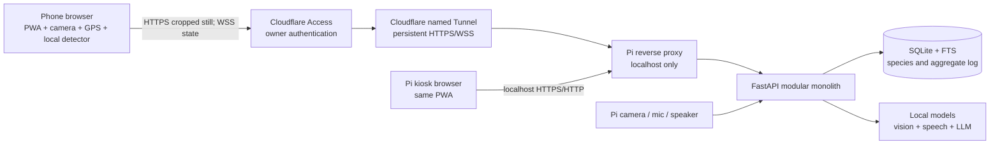

# Botanika Pi Architecture and Implementation Roadmap

**Status:** architecture baseline; no application code yet
**Target hardware:** Raspberry Pi 5, 16 GB RAM, 512 GB SSD, Pi Camera, microphone,
speaker, and screen
**Document date:** 2026-09-01

## 1. Purpose and authority

This is the implementation source of truth for the Pi phase of Botanika. It
turns the project brief into a build order, explicit component boundaries, data
contracts, failure behavior, and acceptance gates.

The latest written requirements take precedence over the earlier pasted
skeleton. The resulting overrides are:

1. Phone and Pi communicate through the internet and do **not** need to share a
   Wi-Fi network.
2. Mode switching is voice-controlled from the Pi for now; physical buttons and
   LEDs are deferred.
3. Networked operation therefore requires internet connectivity, while SOLO
   operation remains locally usable without it.
4. The Pi still owns classification, knowledge, query handling, aggregate data,
   and orchestration. The phone remains an install-free browser client.
5. The weed feature does not create personal-library entries or retain images.
   It may retain a small coordinate observation record when usable location is
   available, because that is necessary for the requested future field-workflow
   extension.

## 2. Product outcome

Botanika has one Pi-hosted system and one responsive web interface with two
presentation profiles:

- **Pi kiosk:** full scan/library/chat experience in SOLO; connection console in
  NETWORKED mode; Pi camera, microphone, speaker, and screen.
- **Phone browser:** locked placeholder in SOLO; pairing screen when NETWORKED
  and unpaired; full scan/library experience while it holds the controller
  lease.

The three primary homepage actions are:

1. **Scan for Plants** — local live boxes and capture-quality checks, followed by
   Pi-side species classification and an optional save to the device library.
2. **Library** — map plus species-grouped discoveries and full plant details.
3. **Weed Detection · Beta** — detect weeds, display boxes, and record location
   observations when possible, without adding plants or images to the library.

The Pi kiosk also exposes a botanical chat interface with offline speech input,
offline grounded answers, on-screen responses, and spoken output.

## 3. Principles that must remain true

- One Pi is the system of record for species knowledge and aggregate events.
- Live video is never streamed to the backend. Only a selected cropped still is
  uploaded for classification.
- Fast detection and capture checks happen on the active device.
- Heavy species classification happens once per accepted capture on the Pi.
- Only one controller is active at a time: Pi or one paired phone.
- SOLO functionality does not depend on an internet service.
- Unknown and low-confidence predictions are rejected rather than presented as
  facts.
- Only the bounding-box crop is saved to a personal library; the full camera
  frame is not saved.
- Repeated discoveries of one species form one list entry with many images and
  many map observations.
- Conservation claims, model assets, and knowledge records retain source and
  license provenance.
- Absence of GPS, camera, a model, a tunnel, or an online answer causes a clear
  degraded state, never a crash.

## 4. Recommended deployment topology

The FastAPI application should be a modular monolith. Multiple independent
containers or microservices would consume memory, complicate audio/camera
ownership, and create avoidable failure modes on one Pi. Modules remain cleanly
separated so they can be extracted later if actual measurements justify it.

### 4.1 Consistent phone-to-Pi connectivity

Use a **named Cloudflare Tunnel** as the production path:

- `cloudflared` runs as a system service on the Pi and makes outbound-only
  connections, so the router needs no port forwarding and the Pi needs no public
  or static IP.
- A stable hostname such as `botanika.example.com` terminates HTTPS and WSS.
- HTTPS is essential: mobile browsers expose camera and geolocation APIs only in
  secure contexts.
- Cloudflare Access sits in front of the application and initially allowlists
  the owner address `kisoreabhinav@gmail.com` using email one-time PIN login.
- The Botanika pairing code is a second, app-level controller handoff; it is not
  a substitute for internet-edge authentication.
- The origin binds to loopback. Only the reverse proxy and tunnel connector can
  reach it. No FastAPI port is exposed directly to the LAN or internet.
- The named tunnel, backend, and kiosk are supervised separately by systemd and
  restart automatically after power or connectivity interruptions.

A Cloudflare-owned domain is required for the stable production hostname. If a
domain is not available during prototyping, Tailscale Funnel provides a stable
`*.ts.net` HTTPS name without requiring a phone app, but it has non-configurable
bandwidth limits and offers less suitable edge access control. Do not use a
Cloudflare Quick Tunnel as the product URL because its random hostname is not a
consistent pairing target.

### 4.2 Offline behavior

The local kiosk, local APIs, databases, model files, web assets, and regional map
tiles are stored on the Pi. If internet connectivity disappears:

- SOLO scanning, classification, library, offline chat, STT, and TTS continue.
- An already loaded phone page may retain its local library, but it cannot send
  new crops to the Pi through the tunnel.
- NETWORKED mode shows “Pi connection lost — your unsaved capture remains on
  this device” and offers retry; it does not silently discard the crop.
- Online knowledge fallback reports that the internet is unavailable and leaves
  the offline answer state intact.

## 5. Runtime modes and controller ownership

### 5.1 State machine

```mermaid
stateDiagram-v2
    [*] --> BOOTING
    BOOTING --> SOLO: local readiness checks complete
    SOLO --> NETWORKED_UNPAIRED: Pi voice command + spoken confirmation
    NETWORKED_UNPAIRED --> NETWORKED_PAIRED: authenticated phone redeems pairing ticket
    NETWORKED_PAIRED --> NETWORKED_UNPAIRED: lease expires / phone disconnects / revoke
    NETWORKED_UNPAIRED --> SOLO: Pi voice command
    NETWORKED_PAIRED --> SOLO: Pi voice command; revoke lease first
```

**SOLO is the safe boot default.** The Pi screen owns camera and UI. Remote
requests receive a read-only “Pi is in solo mode” state and cannot classify,
query, or mutate data.

**NETWORKED_UNPAIRED** shows a short code and QR ticket on the Pi. The phone can
authenticate at the edge and open the pairing page but cannot control a session.

**NETWORKED_PAIRED** grants one phone a renewable controller lease. The Pi
screen becomes a status console showing device label, connection quality,
current activity, and a live event log. A second phone is told that Botanika is
already paired and cannot displace the controller.

### 5.2 Voice-controlled switching

Mode commands are recognized only from the Pi microphone and pass through a
small deterministic intent grammar, never an LLM. Suggested phrases include:

- “Botanika, use solo mode.”
- “Botanika, connect my phone.”
- “Botanika, use networked mode.”
- “Botanika, disconnect the phone.”
- “Botanika, what mode are you in?”

Potentially disruptive switches require a short spoken confirmation. Entering
SOLO revokes the active phone ticket and controller lease before enabling the Pi
camera. The kiosk also keeps an accessible emergency on-screen “Return to SOLO”
control in case the microphone fails; voice remains the normal configuration
path, but hardware failure must not strand the system.

The voice architecture reuses the proven patterns observed in local HYDRA and
InnoHack projects:

- load speech models once and cache them;
- one explicit owner for microphone and speaker resources;
- streaming capture with silence endpointing and a maximum turn duration;
- keep fast partial transcription separate from final transcription work;
- suppress or cancel TTS cleanly when a new command begins;
- keep Piper voices loaded in-process, with a basic speech fallback;
- never download a model implicitly during an offline session.

Use Vosk Indian-English for low-latency fixed mode commands, and benchmark
Whisper.cpp or faster-whisper `tiny/base` for free-form botanical questions.
Piper remains the primary offline TTS engine. This split avoids spending a
large free-form decoder budget on five deterministic commands.

### 5.3 Pairing and lease rules

- The Pi generates a high-entropy, single-use pairing ticket and displays a
  human-friendly short code/QR representation.
- Ticket lifetime: target two minutes; configurable after usability testing.
- Successful redemption returns a secure, HttpOnly, SameSite session cookie.
- The WebSocket binds to that session and renews a short controller lease with
  heartbeats.
- A disconnected controller receives a brief reconnect grace period before the
  lease is released.
- Switching to SOLO, explicit disconnect, service restart, or ticket expiry
  invalidates relevant tokens.
- Pairing attempts are rate-limited and audited without recording raw tokens.
- Never put a long-lived secret, discovery data, or GPS coordinate in the QR
  payload or URL.

## 6. Component architecture

### 6.1 API and orchestration

The API layer validates requests, checks mode/controller policy, assigns a
request ID, and calls an application service. It must not contain model-specific
preprocessing, SQL strings, or speech-device logic.

Planned endpoint groups are contracts, not implementation commitments:

| Surface | Responsibility |
|---|---|
| `/api/v1/health/live` | Process is alive; no expensive dependencies |
| `/api/v1/health/ready` | Database, required models, storage, and mode manager ready |
| `/api/v1/capabilities` | Camera/GPS/model/map/voice availability for this client |
| `/api/v1/mode` | Read current state; Pi-local authenticated control changes it |
| `/api/v1/pairing/ticket` | Pi-local creation of one short-lived ticket |
| `/api/v1/pairing/redeem` | Authenticated phone claims the controller lease |
| `/api/v1/classifications` | Accept one crop and metadata; return ranked identity |
| `/api/v1/species/{id}` | Return sourced static botanical details |
| `/api/v1/aggregate/discoveries` | Append anonymous aggregate event after explicit save |
| `/api/v1/aggregate/summary` | Community counts without exposing raw device trails |
| `/api/v1/chat` | Offline grounded question; optional online fallback |
| `/api/v1/weeds/detections` | Optional Pi-side weed image inference for selected image |
| `/api/v1/weeds/observations` | Store coordinate-only beta observation when permitted |
| `/ws/session` | Mode, pairing, progress, and status events; never video |

Image endpoints enforce MIME allowlists, decoded-image validation, dimension and
pixel limits, body size limits, timeouts, and per-session rate limits. Uploaded
crops are decoded in memory or an isolated temporary area and deleted after the
response. Client filenames are never used as server paths.

### 6.2 Mode and policy manager

This module owns the state machine and controller lease. Every operation asks it
for permission. The vision, chat, discovery, and weed modules must not infer
authorization from the UI route or from “a WebSocket exists.”

Mode changes are serialized. A transition first stops the old camera/audio
owner, revokes the old controller, updates durable state, initializes the new
owner, and only then announces completion. On failure it returns to SOLO with a
visible diagnostic.

### 6.3 Vision coordinator

The Pi has one inference coordinator with bounded queues and priorities:

1. mode-command speech recognition;
2. active plant classification;
3. weed inference;
4. botanical chat generation;
5. background indexing or maintenance.

Only one large CPU-heavy job should run at a time until benchmarks prove safe
concurrency. A new scan may pause/cancel LLM generation rather than making the
camera workflow appear frozen. Model loading is explicit and reported through
readiness/capability status.

### 6.4 Species knowledge and botanical guide

The knowledge layer consists of:

- normalized species records in SQLite;
- source/provenance records for every ecological or conservation claim;
- SQLite FTS5 for exact/common/scientific-name and keyword retrieval;
- a compact local embedding index for semantic retrieval;
- document chunks linked back to species and source records;
- a small quantized GGUF instruct model served through llama.cpp;
- response policy that requires retrieved evidence and returns citations.

The first retrieval pass should prefer the active scan’s species, then expand to
the regional corpus. The LLM is allowed to summarize retrieved facts, not invent
missing ones. If retrieval cannot support the question, Botanika says:

> Could not find enough detail in the offline botanical library. Searching
> online for a better response.

It then performs an online search only if internet access is available, clearly
labels the result “Online,” attaches source links, and never mixes unsourced
online text into the offline knowledge database. If the user begins a question
with “search,” online retrieval is selected immediately. If offline, it says so
instead of repeatedly retrying.

Candidate seed sources include regional floras/herbaria, IUCN conservation data,
GBIF occurrence data, and carefully licensed Wikipedia/Wikidata extracts. Each
source requires a documented license, retrieval date, geographic scope, and
transformation record before ingestion. “Native” must come from a regional
authority or curated project field, not be inferred solely from occurrence dots.

### 6.5 Storage ownership

| Data | Owner | Persistence |
|---|---|---|
| Species knowledge and source provenance | Pi SQLite | Durable, backed up |
| RAG chunks and vector index | Pi | Rebuildable from versioned source manifest |
| Anonymous aggregate discovery events | Pi SQLite | Durable; coarse location only |
| Personal library records and crops | Active browser IndexedDB | Durable per browser/device |
| Classification upload | Pi temporary storage/memory | Deleted after response |
| Pairing tickets and active leases | Pi memory plus minimal state | Short-lived |
| Weed crop | Active device/Pi temporary buffer | Deleted after result |
| Weed coordinate observation | Pi beta table/export queue | Coordinate-only, explicit retention |
| Audit and health logs | Pi journal/rotating logs | Bounded; no images/tokens |

Use IndexedDB, not `localStorage`, for personal images and structured discovery
records. The Pi kiosk and a phone naturally have separate personal libraries.
An opt-in encrypted sync feature may be designed later, but it is not silently
introduced into the anonymous aggregate log.

## 7. Plant scan flow

### 7.1 Device-side live loop

1. The active UI requests camera permission and chooses the rear/environment
   camera on a phone or Pi Camera adapter on the kiosk.
2. A small local detector processes resized frames at an adaptive cadence. It
   returns plant/organ boxes only; it does not claim a species.
3. The overlay draws each box. The chosen target is the largest stable box near
   the center, unless the user taps a different box.
4. Stability uses box overlap/center movement across consecutive frames.
5. Quality uses Laplacian variance for blur plus exposure, target size, and edge
   clipping checks. Thresholds are calibrated separately for the phone class and
   Pi Camera instead of being treated as universal constants.
6. When one target is stable and sharp for the configured consecutive-frame
   window, auto-capture locks. A manual shutter remains available.
7. The client crops the detected box with small context padding, corrects image
   orientation, bounds its resolution, compresses it, and keeps the crop in
   memory. The complete frame is not uploaded or saved.
8. The overlay changes to “Processing…” and sends one crop plus detector/quality
   metadata to the Pi.

### 7.2 Pi classification

1. Validate the controller lease, content type, decoded dimensions, request size,
   and crop quality.
2. Normalize using the exact preprocessing contract shipped with the selected
   model.
3. Route to the regional general classifier; optionally invoke a specialist only
   when the model registry and organ evidence justify it.
4. Apply temperature/calibration metadata and return top candidates.
5. Combine visual score with optional location/season priors only as a separate,
   disclosed reranking signal. Never hide the raw visual score.
6. Reject results below the validated threshold or with excessive top-1/top-2
   ambiguity. Return “Not confident — try another angle” rather than a false ID.
7. Join the accepted species to the offline knowledge record and return display
   details and source IDs.

The successful response updates the target overlay exactly as requested:
scientific/common name above the box and confidence below it. The details panel
shows family, conservation status, native/region category, notes, and a **Save to
Library** action. “Confidence” is a calibrated model score; the UI must not call
it a probability unless calibration testing supports that wording.

### 7.3 Save behavior

Saving is explicit and separate from classification:

1. Ask for device location with high accuracy and a bounded timeout.
2. Save the crop, result snapshot, capture time, latitude, longitude, horizontal
   accuracy, and model version to IndexedDB. If location is denied/unavailable,
   offer “Save without location.”
3. Upsert by stable `species_id`. If the species exists, append a new observation
   and image; do not create another species row.
4. Send an anonymous aggregate event to the Pi only after the local save. Round
   or grid the location according to privacy settings and use a rotating device
   pseudonym rather than user identity.
5. Confirm what was saved and whether a location was included.

## 8. Library and map experience

The Library screen is divided vertically:

- **Top:** interactive regional map with the discovered areas/points highlighted.
- **Bottom:** scrollable species list grouped by identity.

Use MapLibre GL JS with a small, licensed regional vector-tile package served by
the Pi and cached by the PWA. This produces the requested Google-Maps-like
experience without forcing a Google API key, billing account, or an online map
dependency. Google Maps remains possible later if its billing and API-key
requirements are accepted.

Map behavior:

- render an accuracy circle for each observation instead of pretending phone GPS
  is exact;
- cluster nearby observations when zoomed out and reveal distinct points when
  zoomed in;
- repeated discoveries of one species at two locations show both locations;
- use the same category color and symbol in the map and list;
- use heat/hex cells only when enough observations exist; a single point is not
  presented as a discovered “region”;
- keep basic map browsing functional with the local regional tile pack.

Initial visual system:

| Priority | Characteristic | E-ink color | Redundant cue |
|---|---|---|---|
| 1 | Endangered/threatened | muted rust | warning diamond |
| 2 | Region-specific/native | deep botanical green | leaf badge |
| 3 | Generic | graphite | circle badge |

If a plant is both native and threatened, threat color wins and the native leaf
badge remains. This precedence prevents contradictory colors and preserves all
meaning. Icons/patterns make the system usable for color-vision differences.

Each bottom-list row contains the newest cropped image on the left, common name
and scientific name in the center, and a vertical three-dot action on the right.
Opening details shows every saved crop, all discovery times and map points, the
classification/model snapshot from scan time, and full stored botanical details.

## 9. E-ink plant-themed interface

The homepage composition is fixed:

- centered Botanika wordmark/icon at the top, using a simple leaf/herbarium
  motif that stays readable at small sizes;
- three large centered actions with generous touch targets;
- illustrated leaves and bushes framing the bottom-left and bottom-right corners;
- warm paper background, near-black ink, and restrained botanical green;
- “Weed Detection” carries a visible Beta tag;
- status strip for SOLO/NETWORKED, Pi reachability, and offline state.

Decorative plants must be lightweight SVG/CSS assets, marked as presentation so
screen readers ignore them, and kept outside the three buttons’ hit areas. Avoid
constant animation; use brief state transitions and high-contrast processing
feedback. Respect reduced-motion preferences and provide text for every icon.

Responsive profiles share components and tokens:

- phone: portrait-first, thumb-reachable actions, rear camera, geolocation;
- Pi kiosk: configured screen resolution, larger targets, Pi Camera adapter,
  voice status and chat access;
- desktop development: simulated capabilities and uploaded fixtures only.

## 10. Weed Detection beta

“Weed” is an agricultural/contextual label, not a universal visual category. A
plant can be a crop in one setting and a weed in another. Therefore the beta
must use a dedicated detector trained for the selected crop/region and must show
its supported species/context.

Flow:

1. Open live camera or choose one image.
2. Run the dedicated weed detector locally when a browser-compatible model is
   available; otherwise send one selected still to the Pi.
3. Draw a box, class label, and confidence for every supported weed.
4. Do not add detections or images to the personal plant library.
5. Request location once. If available, create coordinate-only observation
   records for the detection event; immediately discard the image after results.
6. If location is unavailable, keep the visual result and show: “Exact location
   couldn’t be found; skipping coordinate collection.”

Important accuracy limitation: ordinary phone/Pi GPS gives the **camera’s
location**, not the ground coordinate of each weed inside a bounding box. All
boxes in one image would otherwise receive nearly the same coordinate. Store
`observation_latitude`, `observation_longitude`, `horizontal_accuracy_m`, and
`target_coordinate_status = camera_location_only`. A future target coordinate
requires camera pose, heading, range/depth, calibration, and preferably RTK GNSS
or surveyed field geometry.

No weed observation may directly command a drone or herbicide system. A future
export requires operator review, confidence thresholds, geofencing, no-spray
zones, target-coordinate validation, and a separate safety architecture.

## 11. Model strategy and research conclusion

### 11.1 What YOLO does and does not provide

Ultralytics supports detect, segment, and classify tasks and can export to ONNX,
TFLite, and other edge formats. Standard pretrained detection weights, however,
are trained on general-purpose datasets and do not identify local plant species.
At most, a generic class such as “potted plant” is useful for a demo—not for the
requested botanical workflow.

Use two model contracts:

- **Detector:** tiny model with boxes for `plant` and, after custom training,
  useful organs such as leaf, flower, fruit, bark, or whole plant. Export an
  INT8/FP16 ONNX/ORT artifact for ONNX Runtime Web and an ONNX/TFLite artifact
  for the Pi camera path.
- **Species classifier:** MobileNetV3, EfficientNet-Lite0, or similarly compact
  backbone fine-tuned on a deliberately bounded regional species catalog. Run
  on the Pi and return calibrated top-k identities plus rejection state.

### 11.2 Candidate data/model assets

| Candidate | Useful for | Limitation / decision |
|---|---|---|
| Pl@ntNet-300K | Research baseline; 1,081-species weights and metadata | Long-tailed/global mismatch; PyTorch baseline is not automatically Pi-optimized |
| PlantCLEF 2024/2025 assets | Large plant corpus and multi-species research | Southwest-Europe focus and heavy models; poor direct match unless the target region matches |
| Regional iNaturalist/GBIF observations | Fine-tuning candidate and location priors | Labels, duplicates, licensing, leakage, and geographic bias require curation |
| Regional herbarium/flora images | Trusted native-species coverage | Often limited views and license constraints |
| DeepWeeds | Weed-classification benchmark | Eight Australian weeds; classification images, not a universal bounding-box detector |
| 4Weed | Starter bounding-box experiment | Only four corn/soybean weeds and a small dataset; not deployment coverage |

Do not begin with separate tree, flower, leaf, and weed species classifiers all
resident in memory. Start with a regional general classifier and collect a
confusion matrix by organ/view. Add a specialist only when the general model
demonstrably fails a defined group and the detector can route to it reliably.

### 11.3 Model contract required before activation

Every runtime model directory must eventually include:

- model name, semantic version, task, and owner;
- artifact hash and immutable label map;
- source datasets, licenses, consent/provenance, and geographic scope;
- required input size, color order, normalization, and crop policy;
- output tensor meaning and post-processing;
- class-wise validation metrics, calibration method, and rejection threshold;
- test split strategy proving near-duplicates and observations did not cross
  train/test boundaries;
- Pi latency, memory, temperature/throttling, and browser compatibility results;
- known unsupported species/views and intended-use warning.

Ultralytics licensing must be reviewed before choosing it for distribution: its
current open-source route is AGPL-3.0 and it also offers an enterprise license.
The architecture is runtime-agnostic so a different detector can be substituted.

## 12. Logical data model

### 12.1 Pi species database

Core entities:

- `species`: stable ID, scientific/common names, family, taxonomy, description;
- `species_category`: generic/native/region-specific flags and curated region;
- `conservation_assessment`: authority, status, assessed date, scope, source;
- `ecology_note`: typed note, text, source, locale;
- `known_occurrence`: coarse coordinates/region, source, observation date;
- `source`: title, publisher, URL/identifier, license, retrieved date;
- `knowledge_chunk`: normalized text, species link, source link, embedding key;
- `model_release`: version, labels/hash, thresholds, provenance, active flag;
- `aggregate_discovery`: species, time bucket, coarse cell, rotating device hash;
- `weed_observation`: event time, camera coordinates, accuracy, detector version,
  count, coordinate status; no retained image.

Migrations are versioned and backups are taken before schema changes. Seed data
is idempotent. Scientific-name aliases resolve to one accepted species ID so
model label changes do not split the library.

### 12.2 Browser personal library

- `library_species`: species ID, names, category/status snapshot, latest image;
- `discovery`: ID, species ID, time, location, accuracy, classifier/model snapshot;
- `discovery_image`: ID, discovery ID, cropped blob, dimensions, hash;
- `settings`: permissions, map preferences, privacy precision, UI preferences;
- `outbox`: aggregate events waiting for Pi acknowledgement.

Species ID is the grouping key. Image hashes prevent accidental duplicate saves,
while a genuine repeat observation still retains its time and location.

## 13. Failure behavior and user messages

| Failure | Required behavior |
|---|---|
| Camera denied | Explain permission path; offer image upload where applicable |
| Detector unavailable | Manual centered crop; label degraded mode |
| Frame blurry/unstable | Keep live preview and show one actionable hint |
| Pi unreachable | Retain crop locally, show retry/cancel, never show false success |
| Classifier busy | Queue one request and show position/timeout; prevent duplicate POSTs |
| Low confidence | “Not confident — try leaf, flower, bark, or another angle” |
| Species absent from KB | Show identity candidates but mark details unavailable |
| GPS denied/timed out | Allow plant save without location; weed toast and skip coordinates |
| Map tiles absent | Show list and simple coordinate summary; no blank-screen failure |
| Phone disconnects | Grace period, then release lease and return to unpaired console |
| Voice command unclear | Ask once for SOLO or NETWORKED; do not guess |
| Tunnel down | SOLO continues; status console reports remote access unavailable |
| Offline RAG lacks answer | Announce online fallback; if offline, say search unavailable |
| Model missing/invalid | Capability unavailable; startup remains diagnosable |

## 14. Security and privacy baseline

- Cloudflare Access authenticates the owner before traffic reaches Botanika.
- App pairing controls exclusive session ownership after edge authentication.
- State-changing requests require the secure session plus CSRF protection.
- Validate Access identity tokens at the origin; do not trust a client-supplied
  email header unless the tunnel guarantees and the backend verifies it.
- Restrict CORS to the production origin; do not use wildcard credentials.
- Use HTTPS/WSS externally, secure cookies, short expiries, rate limits, and
  bounded upload sizes.
- Avoid storing exact personal routes in the aggregate database. Store coarse
  cells and rotating pseudonyms.
- EXIF metadata is stripped from crops before persistence or aggregate handling.
- Logs omit raw images, transcripts by default, tokens, exact GPS, and question
  text unless the user explicitly enables diagnostic capture.
- Secrets are provisioned outside Git with restrictive file permissions.
- Backup personal/aggregate databases encrypted; test restore, not only backup.
- Dependency, model, data, and license manifests are release gates.

## 15. Repository module boundaries

The full tree and directory-by-directory ownership are in
[`REPOSITORY_STRUCTURE.md`](REPOSITORY_STRUCTURE.md). The important dependency
direction is:

`API/adapters → application modules → domain contracts → storage/model adapters`

Frontend feature modules call shared platform adapters. They do not import one
another’s internal state. Backend model adapters never import FastAPI, and
storage adapters never own mode policy.

## 16. Ordered implementation roadmap

Each stage ends with a measurable gate. Do not start the next stage merely
because a screen looks complete.

### Stage 0 — Remote connectivity proof (build this before the backend)

**Goal:** prove that a phone on a different network can securely and consistently
reach a placeholder on the Pi.

1. Acquire/configure a Cloudflare-managed domain and choose the stable hostname.
2. Create a named tunnel and install `cloudflared` for ARM64 as a system service.
3. Put Cloudflare Access in front of the hostname and allow only the owner email.
4. Serve a minimal static placeholder on loopback through the future reverse
   proxy path.
5. Verify HTTPS from a phone on mobile data, not the Pi Wi-Fi.
6. Verify a browser WebSocket survives normal use and reconnects after toggling
   airplane mode.
7. Reboot the Pi and confirm backend placeholder, tunnel, and kiosk supervision
   recover without a terminal login.
8. Confirm the origin port is not reachable directly from another LAN device.
9. Record latency for health request, WebSocket reconnect, and a representative
   cropped-image upload.

**Gate:** stable URL, authenticated remote browser, camera/GPS secure-context
eligibility, reboot recovery, and no inbound router port.

### Stage 1 — Repository and platform foundation

1. Select/pin Python, Node, package managers, and supported OS release.
2. Create the FastAPI shell, PWA shell, typed shared API schema, config loader,
   structured logging, request IDs, and health/capability surfaces.
3. Define environment separation: development, Pi staging, Pi production.
4. Add model/data asset manifests with hashes and license fields.
5. Add SQLite migrations and backup/restore operator workflow.
6. Add systemd sandboxing, writable runtime paths, log rotation, and service
   dependency ordering.

**Gate:** clean-device setup is reproducible; liveness/readiness accurately fail
when a dependency is removed; secrets and generated data are absent from Git.

### Stage 2 — Mode, voice, pairing, and exclusive control

1. Implement the mode state machine and durable SOLO default.
2. Implement audio ownership and deterministic Vosk mode-command recognition.
3. Add Piper confirmation speech and on-screen status captions.
4. Add ticket generation, QR/short code, redemption, secure session cookie,
   WebSocket heartbeat, reconnect grace, and revocation.
5. Make the same PWA render kiosk, placeholder, pairing, controller, and console
   profiles from server-authoritative state.
6. Test switching while scanning, disconnected, busy, and after restart.

**Gate:** 100 consecutive automated transitions preserve one controller; a
second phone cannot take control; voice failure still allows local safe recovery.

### Stage 3 — E-ink UI shell and device capabilities

1. Finalize Botanika logo/wordmark and corner foliage assets.
2. Build accessible theme tokens and the three-button homepage.
3. Implement phone and kiosk camera adapters behind one interface.
4. Implement phone geolocation adapter with accuracy/timeout states.
5. Implement toasts, offline/reconnect state, and IndexedDB migrations.
6. Add reduced-motion, keyboard/touch, and screen-reader checks.

**Gate:** homepage and navigation work at target phone sizes and Pi resolution;
permissions denied/accepted states are both usable.

### Stage 4 — Detection, quality lock, and crop pipeline

1. Define target detector classes and collect representative phone/Pi frames.
2. Train/export the smallest viable detector; benchmark ONNX Runtime Web WASM
   baseline, then WebGPU where supported.
3. Add live overlay, target selection, stability calculation, exposure/size
   rules, Laplacian blur score, and manual capture.
4. Create a calibration tool and store thresholds by camera profile.
5. Crop with context padding and verify that neither upload nor local save uses
   the full frame.
6. Test orientation, low light, multiple plants, motion, background vegetation,
   and browser thermal throttling.

**Gate:** device-specific target FPS/latency and false-capture limits are met on
real phone and Pi hardware; full-frame retention test passes.

### Stage 5 — Species classifier and knowledge response

1. Freeze the first region and supported species list; include at least two
   locally native focus species and visually confusing negatives.
2. Build deduplicated observation-level train/validation/test splits.
3. Benchmark MobileNetV3/EfficientNet-Lite and one Pl@ntNet-derived baseline off
   Pi; select by class metrics, calibration, size, and Pi latency.
4. Export/quantize the winner and register its full contract.
5. Implement validated classification, calibrated top-k, rejection, and species
   database join.
6. Render processing, accepted, ambiguous, unsupported, and retry states; place
   name above and confidence below the locked box.

**Gate:** class-wise acceptance criteria and rejection behavior pass on a held-
out regional field set; thermal and concurrent-load Pi tests pass.

### Stage 6 — Personal library, aggregate log, and map

1. Implement explicit save, location timeout, crop blob storage, and outbox.
2. Group by species ID and append repeated images/observations.
3. Build split Library screen, details drawer, category precedence, and matching
   list/map symbols.
4. Package regional MapLibre tiles and test offline map fallback.
5. Add coarse anonymous aggregate event ingestion and community summaries.
6. Test migrations, quota limits, export/delete, duplicate crops, two locations,
   and location-denied saves.

**Gate:** one species remains one row with multiple crops and points; exact
personal coordinates never appear in aggregate API/logs.

### Stage 7 — Offline botanical chat and voice

1. Curate licensed regional sources and build provenance-first ingestion.
2. Add FTS retrieval, embeddings, species-aware ranking, and retrieval tests.
3. Benchmark small GGUF candidates on the Pi and define response latency limits.
4. Add question STT, grounded answer generation, on-screen citations, Piper TTS,
   interruption, and inference priority.
5. Add automatic missing-answer online fallback and explicit `search` routing.
6. Test hallucination traps, conflicting sources, no evidence, no internet,
   classification arriving during generation, and microphone/speaker contention.

**Gate:** every factual offline answer maps to retrieved source records; missing
answers abstain; scan classification retains priority over chat.

### Stage 8 — Weed beta (build last)

1. Define crop, region, supported weeds, and coordinate semantics with users.
2. Select/collect bounding-box data; do not mistake classification-only datasets
   for detection readiness.
3. Train/export a dedicated detector and validate class-wise field performance.
4. Add live/upload flow, multi-box overlays, coordinate request, required toast,
   coordinate-only persistence, and immediate image deletion.
5. Add reviewed export format marked `camera_location_only`.
6. Conduct safety review before any future drone integration.

**Gate:** unsupported weeds are not claimed, no images/library entries persist,
GPS absence never crashes, and exported coordinates cannot be mistaken for
validated target coordinates.

### Stage 9 — Gamification, evaluation, and submission hardening

1. Add personal coverage/categories and anonymous aggregate summaries without
   changing privacy boundaries.
2. Conduct at least five structured user tests covering discovery, pairing,
   accessibility, trust in confidence, and recovery from errors.
3. Measure task completion, capture retries, classification acceptance, latency,
   and qualitative feedback; record changes made from feedback.
4. Complete NGCPR/native-species evidence, model cards, data/source register,
   security review, recovery drill, demo script, and offline demo package.

**Gate:** requirements traceability and demo recovery checklist pass on the
actual Pi without developer tools open.

## 17. Cross-stage verification targets

Set final numeric targets only after the first hardware benchmark, but track:

- detector median/p95 frame latency and sustained FPS by phone/Pi;
- stability-lock time and false auto-capture rate;
- crop upload p50/p95 over mobile networks;
- classifier p50/p95 latency, peak RSS, CPU temperature, throttling;
- macro-F1, per-class recall, top-k accuracy, expected calibration error, and
  unknown rejection performance;
- pairing time, reconnect time, lease exclusivity failures;
- IndexedDB quota behavior and database migration/restore success;
- RAG retrieval recall and citation support rate;
- time to first spoken token and interruption latency;
- cold boot to SOLO-ready and networked-ready times.

## 18. Requirement traceability

| Requirement | Architecture response |
|---|---|
| Pi backend classifies plants | Vision coordinator + regional species classifier |
| E-ink homepage and plant decoration | Shared PWA theme and fixed homepage composition |
| Three buttons | Scan, Library, Weed Detection Beta feature modules |
| Boxes, sharpness/blur, processing | Local detector + calibrated quality lock + state overlay |
| Name above/confidence below box | Accepted-result overlay contract |
| Save crop and GPS | IndexedDB discovery with crop-only blob and geolocation accuracy |
| Repeated species grouped | Stable species key with multiple observations/images |
| Map and matching characteristic colors | Split Library, category precedence, shared symbols |
| Weed boxes, no plant-library save | Dedicated beta pipeline and temporary crop lifecycle |
| Weed coordinate failure toast | Explicit degraded behavior and required message |
| Pi botanical Q&A with voice | Offline RAG + free-form STT + Piper + kiosk chat |
| Missing offline answer searches online | Abstention policy and labeled online fallback |
| Separate/suitable plant models | Detector/classifier split and benchmarked specialist routing |
| Phone and Pi on different networks | Named outbound tunnel, HTTPS/WSS, edge authentication |
| Voice-based SOLO/NETWORKED toggle | Pi-only deterministic voice intents and state machine |
| Same web UI on phone and Pi | Capability-adaptive PWA served by Pi |
| Offline SOLO | Local assets, models, knowledge, speech, database, and map tiles |
| Conservation/NGCPR alignment | Sourced status, regional-native category, native focus set |

## 19. Decisions required before implementation

These do not block the architecture skeleton, but each blocks a later stage:

1. **Stable hostname:** Cloudflare-managed domain/subdomain, or Tailscale Funnel
   for prototype only.
2. **Target region:** exact geography and first supported native species catalog.
3. **Primary phones/browsers:** at least one Android and/or iPhone model for real
   detector and camera constraints.
4. **Map source:** accept recommended MapLibre regional tiles or fund Google Maps
   API billing and key management.
5. **Personal data:** browser-only library as specified, or a future opt-in sync
   requirement.
6. **Weed context:** crop, field, supported weed list, and usable positioning
   hardware.
7. **Model/data licenses:** distribution intent and whether AGPL dependencies are
   acceptable.
8. **Languages:** English only initially, or English/Hindi voice and knowledge.

## 20. Research references

- Cloudflare Tunnel overview: <https://developers.cloudflare.com/tunnel/>
- Cloudflare Tunnel configuration/high availability:
  <https://developers.cloudflare.com/tunnel/configuration/>
- Cloudflare Linux service:
  <https://developers.cloudflare.com/tunnel/advanced/local-management/as-a-service/linux/>
- Cloudflare private web application and Access:
  <https://developers.cloudflare.com/cloudflare-one/setup/secure-private-apps/private-web-app/>
- Tailscale Funnel alternative:
  <https://tailscale.com/docs/features/tailscale-funnel>
- Browser camera secure-context requirement:
  <https://developer.mozilla.org/en-US/docs/Web/API/MediaDevices/getUserMedia>
- ONNX Runtime Web:
  <https://onnxruntime.ai/docs/tutorials/web/>
- Ultralytics task/model documentation:
  <https://docs.ultralytics.com/models/>
- Ultralytics licensing:
  <https://www.ultralytics.com/license>
- Pl@ntNet-300K dataset and pretrained baselines:
  <https://github.com/plantnet/PlantNet-300K>
- PlantCLEF 2025 dataset description:
  <https://www.kaggle.com/competitions/plantclef-2025/data>
- DeepWeeds paper: <https://doi.org/10.1038/s41598-018-38343-3>
- 4Weed paper/data: <https://arxiv.org/abs/2204.00080>
- Google Maps JavaScript API setup requirements:
  <https://developers.google.com/maps/documentation/javascript/get-api-key>
