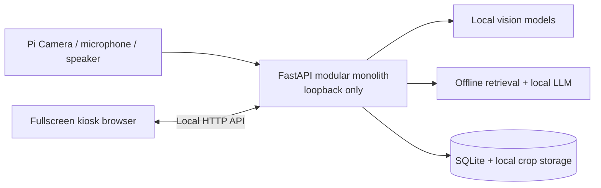

# Botanika Pi-Only Architecture and Roadmap

**Status:** clean architecture baseline; implementation starts with hardware
verification
**Target:** Raspberry Pi 5, 16 GB RAM, 512 GB SSD, Pi Camera, local screen,
microphone, and speaker

## 1. Scope

Botanika runs entirely on one Raspberry Pi. The Pi owns the camera, user
interface, model inference, botanical knowledge, discovery library, microphone,
speaker, and process supervision.

The web interface is an implementation choice for building a responsive kiosk,
not a remote-client architecture. It is served locally and displayed by a
fullscreen browser on the Pi.

Excluded from this phase:

- cloud inference or required internet services;
- GPS/map behavior without real positioning hardware;
- physical mode switches and LEDs;
- drone or chemical-actuation integration.

## 2. Required outcomes

1. The Pi boots into a reliable Botanika kiosk.
2. The Pi Camera shows a local preview with plant/organ boxes.
3. A stable and sharp target produces one bounding-box crop.
4. The Pi classifies that crop and shows name plus calibrated confidence.
5. The user can save only the crop into a species-grouped local library.
6. The Pi answers botanical questions from sourced offline knowledge through
   text, microphone, screen, and speaker.
7. A dedicated weed detector is added last as a clearly scoped beta.

## 3. Architectural principles

- One Pi and one active local interface.
- Offline operation is the default, not a fallback.
- Live detection is lightweight and continuous; species classification is
  heavier and event-driven.
- Full camera frames remain transient and are never saved to the library.
- Low-confidence predictions abstain.
- Every botanical fact and model artifact has source/license provenance.
- Camera, audio, storage, and inference resources have explicit owners.
- Failures disable one capability with a clear message rather than crashing the
  whole kiosk.
- Measurements on the actual Pi decide thresholds and concurrency.

## 4. Local topology



The application is a modular monolith. Separate processes are limited to true
runtime boundaries such as the kiosk browser and optional llama.cpp server.
Microservices add no useful isolation on one Pi and make shared hardware and
resource scheduling harder.

## 5. Runtime ownership

### 5.1 Camera owner

One camera service opens the Pi Camera and publishes frames to local consumers.
It owns resolution, exposure profile, frame timestamps, shutdown, and recovery.
Detection can receive resized frames. Still capture produces a transient source
frame for cropping and then releases it.

The browser must not open a competing camera handle if the backend camera
service owns the device. Choose one camera path during Stage 0/1 and expose a
clean adapter to the scan feature.

### 5.2 Audio owner

One audio coordinator controls microphone input and speaker output. It prevents
STT, TTS, test tones, and future sound cues from racing for ALSA/PipeWire
devices. It supports cancellation and reports device readiness.

### 5.3 Inference coordinator

Begin with one heavy inference job at a time:

1. active scan classification;
2. weed inference;
3. chat generation;
4. background indexing or maintenance.

Real-time detection has its own bounded loop and drops stale frames rather than
building a queue. A new scan may pause chat generation if benchmarks show CPU or
thermal contention.

## 6. Backend modules

The future FastAPI package is divided by responsibility:

| Module | Ownership |
|---|---|
| `api` | Local HTTP routes, schemas, errors, request IDs |
| `core` | Settings, lifecycle, capabilities, inference budget |
| `hardware` | Camera, microphone, speaker, display adapters |
| `vision/detection` | Plant/organ boxes and model contract |
| `vision/quality` | Stability, blur, exposure, crop construction |
| `vision/classification` | Species classifier, calibration, rejection |
| `vision/weeds` | Independent weed-beta detector |
| `knowledge` | Ingestion, retrieval, citations, grounded answers |
| `voice` | STT, TTS, audio ownership, cancellation |
| `discoveries` | Save/group/export/delete behavior |
| `storage` | SQLite migrations, repositories, backup/restore |
| `observability` | Health, metrics, bounded redacted logs |

API handlers validate and delegate. They do not contain model preprocessing,
SQL, or hardware ownership logic.

## 7. Local API surface

The exact schemas are implemented later, but ownership should follow:

| Endpoint group | Purpose |
|---|---|
| `/api/v1/health/live` | Process liveness only |
| `/api/v1/health/ready` | Required local dependencies and writable storage |
| `/api/v1/capabilities` | Camera/audio/model/database availability |
| `/api/v1/camera/*` | Local preview/capture control if backend owns camera |
| `/api/v1/classifications` | Submit one local crop for species inference |
| `/api/v1/species/*` | Sourced local species details |
| `/api/v1/library/*` | Local discovery CRUD and grouping |
| `/api/v1/chat` | Grounded offline botanical question |
| `/api/v1/voice/*` | Local STT/TTS session/status controls |
| `/api/v1/weeds/*` | Local beta inference after earlier stages pass |

Because the UI and API share loopback and one origin, no cross-origin policy or
internet authentication is required. State-changing operations still need
normal validation and explicit confirmation for destructive actions.

## 8. Vision pipeline

```text
Pi Camera
  → resized frame for tiny plant/organ detector
  → local bounding-box overlay
  → selected-target tracking
  → stability + exposure + focus checks
  → one transient still
  → padded bounding-box crop
  → release full still
  → regional species classifier
  → calibrated top-k / unknown rejection
  → sourced species details
  → optional explicit crop-only library save
```

### 8.1 Detector

The detector answers “where is the useful plant target?” rather than “which
species is it?” Candidate classes begin with `plant` and may later include leaf,
flower, fruit, bark, or whole-plant views after custom validation.

Frames are timestamped. Stale work is dropped. Performance tracking includes
median/p95 latency, sustained FPS, CPU temperature, and throttling.

### 8.2 Quality and stability

Capture requires a stable target over multiple detector results. Measure:

- intersection-over-union/box overlap;
- center displacement;
- relative size change;
- edge clipping;
- target pixel size;
- exposure/saturation;
- Laplacian variance or an evaluated alternative focus metric.

Calibration uses actual Pi Camera fixtures. Store thresholds by camera profile
and retain a manual shutter.

### 8.3 Crop contract

- Add a small configurable context margin.
- Clamp coordinates to the real source dimensions.
- Correct orientation exactly once.
- Validate focus/exposure on the crop.
- Resize only according to the classifier contract.
- Strip metadata through re-encoding if necessary.
- Hash the crop for duplicate-save detection.
- Release the original still before persistent storage.

Coordinate-conversion tests must cover detector letterboxing, preview aspect
ratio, overlay scaling, and source dimensions. A correctly drawn overlay does
not prove the extracted pixels are correct.

### 8.4 Species classifier

Use a bounded regional catalog. Compare compact MobileNetV3/EfficientNet-Lite
classifiers and appropriate pretrained botanical baselines, then select using:

- macro and class-wise performance;
- unknown rejection;
- calibration error;
- artifact size and license;
- Pi latency, memory, and thermal behavior.

Location/season priors are absent until trustworthy sensors/data exist. Do not
silently bias classification using network-derived location.

## 9. Local data architecture

### 9.1 Species and knowledge database

Core entities:

- `species` and scientific-name aliases;
- `species_category` and curated geographic scope;
- `conservation_assessment`;
- `ecology_note`;
- `source` and license/retrieval metadata;
- `knowledge_chunk` and embedding reference;
- `model_release` and activation metadata.

### 9.2 Discovery database

- `library_species`: one row per stable species ID;
- `discovery`: capture time, result snapshot, classifier version, confidence;
- `discovery_image`: managed crop path, dimensions, content hash;
- optional operator note;
- timestamps for create/update/delete/export.

Repeated findings append observations/images to one species entry. Database and
filesystem updates need one transactional service so a failed save does not
leave an orphan record or file.

### 9.3 Filesystem

- Reproducible seed/source manifests remain versioned.
- Generated SQLite, vector indexes, logs, and crops stay outside source packages.
- Temporary capture data has a bounded lifecycle.
- Backups include SQLite plus referenced crops and have a tested restore path.

## 10. Kiosk UI

### Homepage

- Botanika wordmark centered at top
- three centered actions: Scan, Library, Weed Detection Beta
- Ask Botanika entry in navigation
- foliage decoration in lower corners
- local capability status without technical noise

### Scan

- large camera preview and canvas overlay
- current capture hint
- manual capture fallback
- processing state
- name above accepted box and confidence below
- details panel and explicit save

### Library

- species-grouped list
- newest crop thumbnail
- characteristic color plus redundant symbol
- details menu with all observations/crops and sourced facts
- confirmed export/delete controls

A map is not part of Pi-only scope until real GNSS hardware is selected and
validated.

### Chat

- scrollable conversation
- text input always available
- microphone control and live transcript when STT is ready
- response text with citations
- spoken response with stop/interruption control

## 11. Offline knowledge and voice

Retrieval uses exact/FTS matching plus a compact embedding index. The current
species receives a ranking preference when the question is contextual. The LLM
summarizes retrieved evidence and must abstain when evidence is insufficient.

Voice follows the patterns already proven in the local HYDRA/InnoHack projects:

- models loaded once;
- bounded single-turn capture;
- silence endpointing;
- separate fast deterministic commands and free-form transcription;
- one audio owner;
- Piper cached in process;
- interruptible output;
- no hidden download while offline.

## 12. Deployment model

Development starts as manually launched loopback services. After behavior is
stable:

1. install the application in an explicit Pi runtime directory;
2. create a dedicated service identity where hardware permissions allow it;
3. install a systemd backend unit with sandboxing and explicit writable paths;
4. add readiness-aware kiosk startup;
5. retain an on-screen/keyboard recovery path;
6. bound logs and verify reboot recovery.

No public listener is part of this phase.

## 13. Verification strategy

### Contract tests

- API/error schema
- model preprocessing/output contracts
- crop coordinate mapping
- database migrations and species grouping
- provenance/citation linkage

### Integration tests

- camera frame → detector → crop
- crop → classifier → species join
- save transaction → file/database consistency
- retrieval → grounded response
- STT/TTS resource ownership

### Hardware tests

- camera absent/busy/reconnect
- supported resolution and focus fixtures
- microphone/speaker contention
- screen/kiosk input and recovery
- SSD full/read-only behavior

### Performance tests

- detector/classifier p50 and p95
- model load and peak RSS
- sustained temperature/throttling
- scan while chat is loaded
- cold boot to ready
- multi-hour soak

### End-to-end journeys

- boot → homepage → scan → accepted/unknown result
- accepted result → save → grouped library details
- text question → cited offline answer
- voice question → visible transcript → spoken answer
- missing capability → clear degraded state

## 14. Ordered stages

| Stage | Outcome | Exit gate |
|---|---|---|
| 0 | Hardware/readiness report | Camera, audio, screen, SSD, thermal facts verified |
| 1 | Local app foundation | One-origin loopback UI/API and honest health checks |
| 2 | E-ink kiosk + camera | Stable local preview and recovery states |
| 3 | Detector + quality crop | Measured boxes and correct crop-only path |
| 4 | Species classifier | Regional held-out accuracy/calibration and Pi performance |
| 5 | Local library | Grouping, crop-only persistence, backup/restore |
| 6 | Offline chat + voice | Sourced answers, abstention, audio ownership |
| 7 | Weed beta | Defined scope, multi-box result, no persistence |
| 8 | Hardening/feedback | Soak/recovery and five-user evidence complete |

The detailed implementation instructions and immediate next task are in the
repository root [`prompt.md`](../prompt.md).
